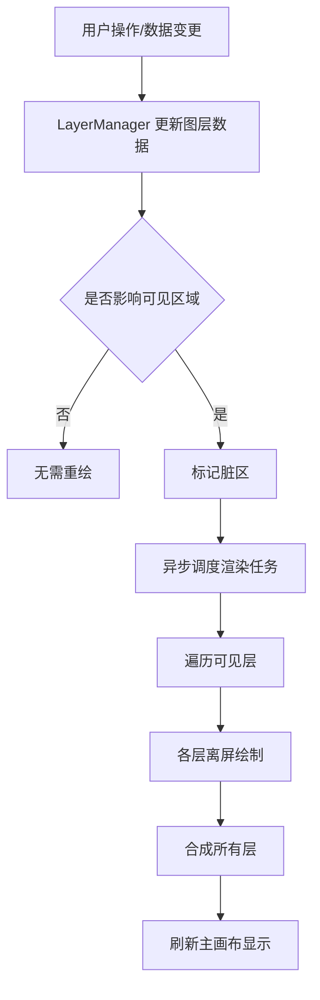
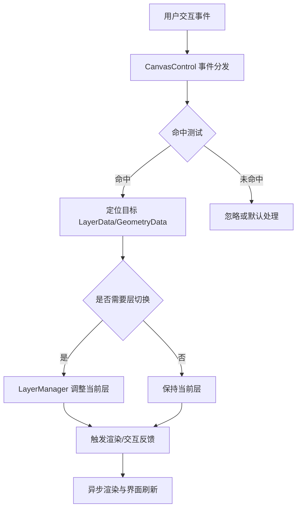
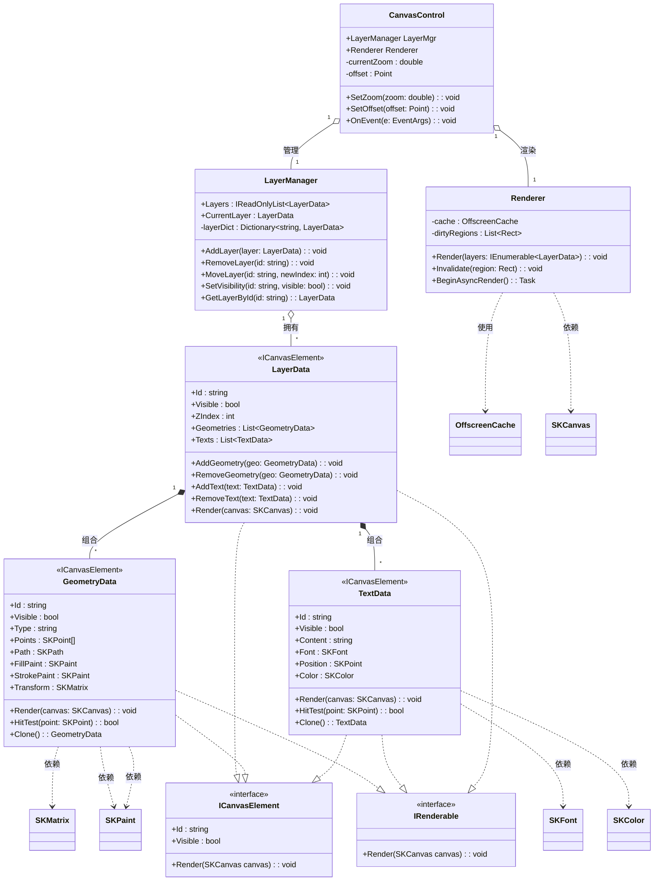
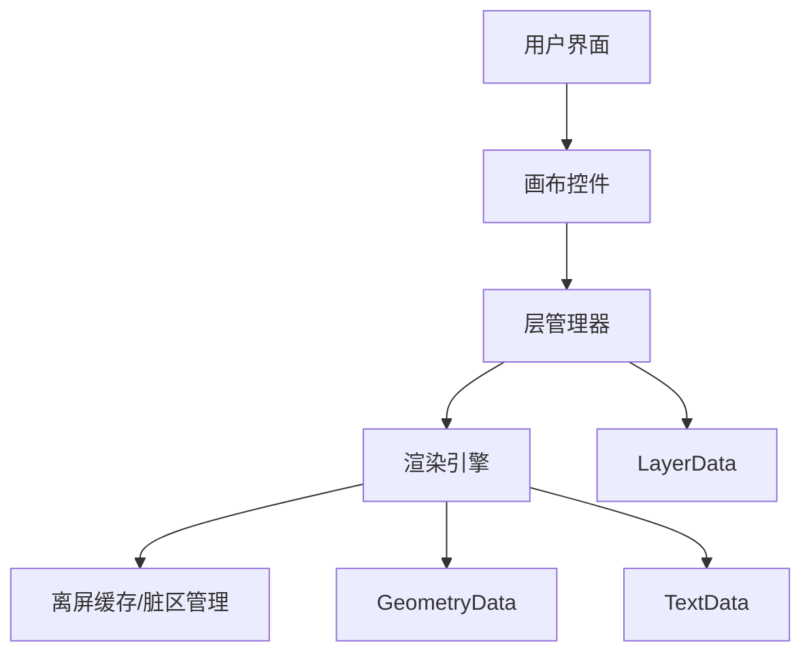
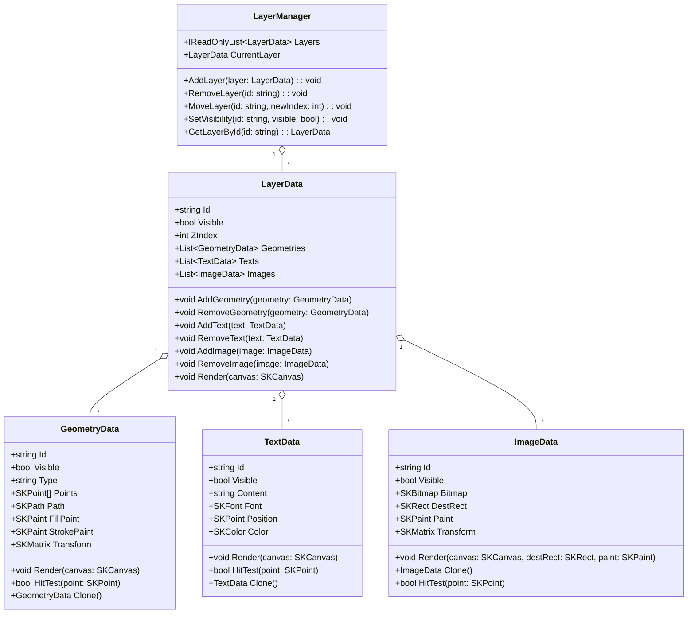
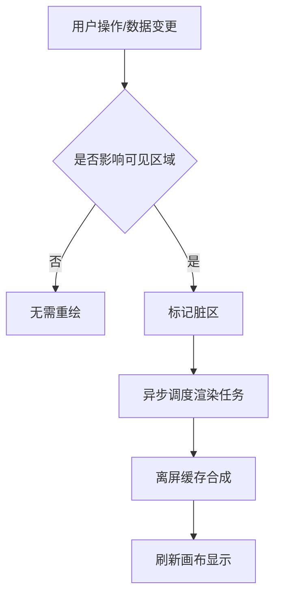

# AvaloniaAsyncDrawing 文档

## 目录

- [AvaloniaAsyncDrawing 文档](#avaloniaasyncdrawing-文档)
  - [目录](#目录)
  - [1. 项目简介](#1-项目简介)
    - [1.1 项目背景与设计目标](#11-项目背景与设计目标)
    - [1.2 适用场景与主要功能概述](#12-适用场景与主要功能概述)
    - [1.3 设计原则与核心价值](#13-设计原则与核心价值)
  - [2. 整体架构设计](#2-整体架构设计)
    - [MVVM 模式声明](#mvvm-模式声明)
    - [2.1 流程图与类图](#21-流程图与类图)
      - [渲染主流程图](#渲染主流程图)
      - [层管理与事件响应流程图](#层管理与事件响应流程图)
      - [主要类/数据结构 UML 类图](#主要类数据结构-uml-类图)
      - [架构关系图](#架构关系图)
    - [2.2 控件结构与主要组件说明](#22-控件结构与主要组件说明)
      - [View/ViewModel 分层结构](#viewviewmodel-分层结构)
      - [数据绑定与命令机制](#数据绑定与命令机制)
    - [2.3 层管理与渲染流程概览](#23-层管理与渲染流程概览)
    - [2.4 关键类与数据结构说明](#24-关键类与数据结构说明)
    - [2.5 属性与方法设计要点](#25-属性与方法设计要点)
    - [2.6 层管理机制](#26-层管理机制)
    - [2.7 渲染流程详细步骤](#27-渲染流程详细步骤)
      - [SkiaSharp 异步与同步绘制实现说明](#skiasharp-异步与同步绘制实现说明)
      - [异步与同步绘制数据传递流程](#异步与同步绘制数据传递流程)
      - [数据完整性与一致性保障](#数据完整性与一致性保障)
      - [线程安全与数据同步关键措施](#线程安全与数据同步关键措施)
      - [典型异步/同步绘制流程代码示例](#典型异步同步绘制流程代码示例)
    - [2.8 缩放与视觉一致性处理](#28-缩放与视觉一致性处理)
    - [2.9 性能优化点](#29-性能优化点)
  - [3. 核心模块说明](#3-核心模块说明)
  - [4. 开发与构建指南](#4-开发与构建指南)
  - [5. API 参考](#5-api-参考)
  - [6. 测试与质量保障](#6-测试与质量保障)
    - [6.1 功能测试点](#61-功能测试点)
    - [6.2 自动化测试建议](#62-自动化测试建议)
    - [6.3 性能与稳定性验证方法](#63-性能与稳定性验证方法)
  - [7. 部署与运行](#7-部署与运行)
  - [8. 常见问题解答（FAQ）](#8-常见问题解答faq)
  - [9. 附录](#9-附录)
    - [9.1 官方文档与相关链接](#91-官方文档与相关链接)
    - [9.2 设计/实现相关论文与技术博客](#92-设计实现相关论文与技术博客)
  - [附：典型代码示例](#附典型代码示例)
    - [多层初始化与添加对象](#多层初始化与添加对象)
    - [添加图片对象](#添加图片对象)
    - [缩放与平移操作](#缩放与平移操作)
    - [切换图层可见性](#切换图层可见性)
  - [典型 MVVM 结构与绑定示例](#典型-mvvm-结构与绑定示例)
    - [ViewModel 结构示例](#viewmodel-结构示例)
    - [XAML 属性与命令绑定示例](#xaml-属性与命令绑定示例)
    - [说明](#说明)
    - [MVVM 模式优势](#mvvm-模式优势)
  - [典型交互演示说明](#典型交互演示说明)
  - [推荐的测试用例与场景](#推荐的测试用例与场景)
  - [需求分析](#需求分析)
    - [功能需求](#功能需求)
    - [非功能需求](#非功能需求)
    - [典型用户场景与使用目标](#典型用户场景与使用目标)

---

## 1. 项目简介

### 1.1 项目背景与设计目标

AvaloniaAsyncDrawing 项目旨在为桌面端应用提供高性能、易扩展的异步绘图解决方案。随着现代 UI 设计对交互性和可视化要求的提升，传统同步绘制方式在复杂场景下常常面临性能瓶颈和响应迟缓的问题。本项目基于 Avalonia 框架，结合异步渲染与分层管理，致力于实现流畅的用户体验和灵活的功能扩展。

设计目标包括：

- 支持多类型图形对象的高效绘制与管理
- 实现分层、缩放、拖拽等高级交互
- 保证在大数据量和高频操作下的性能表现
- 提供易用的 API 以便快速集成与二次开发

### 1.2 适用场景与主要功能概述

适用于需要复杂图形编辑、实时可视化、工程制图、流程建模等桌面应用场景。主要功能包括：

- 支持点、线、面、文本、图片等多类型对象的绘制
- 多层级分组与图层管理
- 画布缩放、平移、选择、拖拽等交互
- 异步渲染与性能优化
- 丰富的扩展接口，便于自定义功能

### 1.3 设计原则与核心价值

- **高性能**：采用异步绘制与分层渲染，提升大规模场景下的响应速度
- **可扩展性**：模块化设计，支持插件与自定义扩展
- **易用性**：简洁直观的 API，降低集成与上手门槛
- **稳定性**：健壮的架构设计，保障长时间运行的稳定性
- **跨平台**：基于 Avalonia，支持主流桌面操作系统

---

## 2. 整体架构设计

### MVVM 模式声明

本项目所有控件及交互严格遵循 MVVM（Model-View-ViewModel）绑定模式，最大限度减少后台代码逻辑。所有界面交互与数据更新均通过数据绑定和命令机制实现，前端 UI 与业务逻辑完全解耦，确保高可维护性和可扩展性。


### 2.1 流程图与类图

#### 渲染主流程图



#### 层管理与事件响应流程图



#### 主要类/数据结构 UML 类图



**设计说明：**

- **ICanvasElement** 接口定义了所有可绘制元素的基础属性（Id、Visible）及渲染方法，便于统一管理和多态操作。
- **IRenderable** 接口专注于渲染行为，部分对象（如LayerData、GeometryData、TextData）实现该接口以支持自定义渲染流程。
- **CanvasControl** 作为顶层控件，聚合 LayerManager 和 Renderer，负责用户交互、缩放、平移等操作，内部维护当前缩放与偏移状态。
- **LayerManager** 负责所有图层的增删改查、顺序调整、可见性切换等，内部通过字典高效索引图层。
- **Renderer** 负责异步渲染调度、离屏缓存与脏区管理，依赖 OffscreenCache 和 SKCanvas 实现高性能绘制。
- **LayerData** 代表单个图层，实现 ICanvasElement 和 IRenderable，组合管理 GeometryData 与 TextData，支持对象的增删与渲染。
- **GeometryData/TextData** 代表具体图形/文本对象，实现 ICanvasElement 和 IRenderable，支持命中测试、克隆、变换等操作。
- **聚合/组合关系**：LayerManager 拥有多个 LayerData，LayerData 组合多个 GeometryData/TextData，生命周期随图层管理。
- **依赖关系**：Renderer 依赖 OffscreenCache、SKCanvas，GeometryData/TextData 依赖样式与变换对象。
- **接口实现**：所有可绘制对象均实现 ICanvasElement，便于统一遍历与操作；渲染相关对象实现 IRenderable，支持多态渲染。

该类图完整表达了核心对象的属性、方法、可见性、继承、接口实现、聚合/组合/依赖等关系，便于后续扩展与维护。

#### 架构关系图



### 2.2 控件结构与主要组件说明

#### View/ViewModel 分层结构

- **View（视图）**：仅负责界面展示和用户交互，所有控件属性、状态、事件均通过数据绑定和命令与 ViewModel 交互，不直接操作后台逻辑。
- **ViewModel（视图模型）**：承载界面状态、属性、命令逻辑，负责响应用户操作、处理业务逻辑，并通过属性通知机制（INotifyPropertyChanged）驱动界面更新。
- **Model（模型）**：存储核心数据结构，与 ViewModel 进行数据交互。

#### 数据绑定与命令机制

- **属性绑定**：View 通过 XAML 绑定到 ViewModel 的属性，实现界面与数据的双向同步。
- **命令绑定**：所有按钮、交互控件的操作均绑定到 ViewModel 的 ICommand，实现无代码后端事件响应。
- **解耦优势**：前端 UI 与业务逻辑完全分离，便于单元测试、功能扩展和维护。


- **画布控件（CanvasControl）**：承载所有图形对象的显示与交互，支持缩放、平移等操作。
- **层管理器（LayerManager）**：负责图层的增删改查、顺序调整、可见性控制。
- **渲染引擎（Renderer）**：异步调度各层的绘制任务，支持离屏缓存与脏区刷新。
- **数据结构（LayerData/GeometryData/TextData）**：描述各类图形对象及其属性。
- **离屏缓存与脏区管理**：提升性能，减少无效重绘。

### 2.3 层管理与渲染流程概览

- 层管理器维护图层集合，支持分组、排序、显示/隐藏。
- 渲染流程采用异步队列，按层级依次绘制，脏区触发局部刷新。

### 2.4 关键类与数据结构说明

> **属性类型统一为 SkiaSharp 类型说明**
> 为提升性能、功能丰富性与跨平台兼容性，所有绘制对象的属性类型（如点、颜色、路径、图片、画笔等）统一采用 SkiaSharp 对应类型，所有渲染方法参数类型统一为 SKCanvas。具体如下，仅保留 SkiaSharp 相关类型：
> - 点/坐标：`SKPoint`
> - 颜色：`SKColor`
> - 路径/几何：`SKPath`
> - 图片：`SKBitmap`
> - 画笔/填充：`SKPaint`
> - 变换：`SKMatrix`
> - 字体：`SKFont`/`SKTypeface`



**设计理由与优势说明：**
- **性能**：SkiaSharp 为 Google Skia 引擎的 .NET 封装，底层采用高效 C++ 实现，支持硬件加速，极大提升大规模绘制场景下的渲染效率。
- **功能丰富**：SkiaSharp 提供完整的 2D 图形 API，支持贝塞尔曲线、复杂路径、渐变、图像滤镜等高级特性，满足复杂业务需求。
- **跨平台一致性**：SkiaSharp 支持 Windows、Linux、macOS 等主流桌面平台，保证绘制效果一致，降低平台适配成本。
- **生态兼容**：与 Avalonia、MAUI 等主流 .NET UI 框架深度集成，便于后续扩展和维护。

**典型数据结构与方法签名示例：**

```csharp
using SkiaSharp;

// 仅保留 SkiaSharp 类型，无任何非 SkiaSharp 依赖
public class GeometryData
{
    public string Id { get; set; }
    public bool Visible { get; set; }
    public string Type { get; set; }
    public SKPoint[] Points { get; set; }
    public SKPath Path { get; set; }
    public SKPaint FillPaint { get; set; }
    public SKPaint StrokePaint { get; set; }
    public SKMatrix Transform { get; set; }

    public void Render(SKCanvas canvas)
    {
        if (!Visible) return;
        if (StrokePaint != null)
        {
            if (Path != null)
                canvas.DrawPath(Path, StrokePaint);
            else if (Points != null && Points.Length > 1)
                canvas.DrawPoints(SKPointMode.Polygon, Points, StrokePaint);
        }
        if (FillPaint != null && Path != null)
            canvas.DrawPath(Path, FillPaint);
    }
}

public class ImageData
{
    public string Id { get; set; }
    public bool Visible { get; set; }
    public SKBitmap Bitmap { get; set; }
    public SKRect DestRect { get; set; }
    public SKPaint Paint { get; set; }
    public SKMatrix Transform { get; set; }

    /// <summary>
    /// 绘制图像，支持像素级渲染、缩放、无插值（默认 NearestNeighbor）。
    /// </summary>
    /// <param name="canvas">目标 SKCanvas</param>
    /// <param name="destRect">目标区域</param>
    /// <param name="paint">绘制参数（可选，支持 FilterQuality 设置）</param>
    public void Render(SKCanvas canvas, SKRect destRect, SKPaint paint = null)
    {
        if (!Visible || Bitmap == null) return;
        canvas.Save();
        canvas.SetMatrix(Transform);
        // 默认无插值，像素级渲染
        var usePaint = paint ?? Paint ?? new SKPaint { FilterQuality = SKFilterQuality.None };
        canvas.DrawBitmap(Bitmap, destRect, usePaint);
        canvas.Restore();
    }

    /// <summary>
    /// 命中测试：判断点是否在目标区域内
    /// </summary>
    public bool HitTest(SKPoint point)
    {
        return DestRect.Contains(point);
    }

    public ImageData Clone()
    {
        return new ImageData
        {
            Id = this.Id,
            Visible = this.Visible,
            Bitmap = this.Bitmap?.Copy(),
            DestRect = this.DestRect,
            Paint = this.Paint?.Clone(),
            Transform = this.Transform
        };
    }
}

public class TextData
{
    public string Id { get; set; }
    public bool Visible { get; set; }
    public string Content { get; set; }
    public SKFont Font { get; set; }
    public SKPoint Position { get; set; }
    public SKColor Color { get; set; }

    public void Render(SKCanvas canvas)
    {
        if (!Visible || string.IsNullOrEmpty(Content)) return;
        using (var paint = new SKPaint { Color = Color, Typeface = Font.Typeface, TextSize = Font.Size })
        {
            canvas.DrawText(Content, Position.X, Position.Y, paint);
        }
    }
}
```

**兼容性与工程实践建议：**
- 推荐所有自定义绘制对象均直接使用 SkiaSharp 类型，避免类型转换损耗。
- 业务层与 UI 层通过接口或 DTO 进行解耦，便于单元测试与跨平台迁移。
- 注意 SkiaSharp 资源（如 SKBitmap、SKPaint）需及时 Dispose，建议结合 using 或对象池管理，防止内存泄漏。
- 若需与 Avalonia 原生类型互操作，可通过类型转换（如 Point ↔ SKPoint）实现平滑集成。

### 2.5 属性与方法设计要点

- **LayerManager**
    - 属性：图层集合、当前选中层、事件回调等
    - 方法：增删改查、顺序调整、可见性切换、批量操作
- **LayerData**
    - 属性：唯一标识、可见性、ZIndex、图形/文本集合
    - 方法：添加/移除对象、设置属性、序列化等
- **GeometryData/TextData**
    - 属性：类型、坐标、样式、变换等
    - 方法：命中测试、变换、克隆等

### 2.6 层管理机制

- **增删改查**：通过 LayerManager 提供统一接口，支持按 Id 操作。
- **顺序调整**：支持拖拽或 API 调整 ZIndex，实时反映在渲染顺序。
- **可见性**：每层可独立显示/隐藏，隐藏层不参与渲染。
- **分组与批量操作**：支持多层分组、批量移动、批量属性设置。

### 2.7 渲染流程详细步骤

#### SkiaSharp 异步与同步绘制实现说明

- **全程采用 SkiaSharp 实现异步绘制**：本项目所有离屏绘制与主画布渲染均基于 SkiaSharp 实现，充分利用其高性能跨平台特性。异步渲染任务通过 `Renderer.BeginAsyncRender()` 调度，所有图层内容先在后台线程离屏绘制，合成后再同步刷新主画布。
- **控件 Render 函数通过 DrawContext.Custom 完成同步绘制**：最终的同步绘制阶段，控件的 `Render` 方法会在 UI 线程调用，通过 `DrawContext.Custom(ICustomDrawOperation custom)`（签名如下）将异步生成的离屏缓存内容绘制到屏幕，确保与 Avalonia 渲染管线兼容。

  ```csharp
  // DrawContext.Custom 的标准签名
  public abstract void Custom(ICustomDrawOperation custom);
  ```
  其中，`ICustomDrawOperation` 需由调用方实现并传入实例，不能直接传递委托或 Action。

#### 异步与同步绘制数据传递流程

1. **数据变更/用户操作**：触发 LayerManager 更新数据，标记脏区。
2. **异步渲染调度**：`Renderer` 检测到脏区后，启动后台线程，遍历所有可见层，依次调用各层的 `Render(ctx)` 方法，利用 SkiaSharp 在离屏 Surface 上绘制。
3. **离屏缓存合成**：各层绘制结果存入线程安全的离屏缓存（如 `SKBitmap`/`WriteableBitmap`），并记录最新版本号。
4. **主线程同步刷新**：UI 线程收到渲染完成通知后，在控件 `Render` 方法中通过 `DrawContext.Custom` 将离屏缓存内容同步绘制到屏幕，保证界面一致性。

#### 数据完整性与一致性保障

- **数据传递**：异步线程仅读取不可变快照数据（如深拷贝的 LayerData/GeometryData），避免与主线程直接共享可变对象。
- **一致性措施**：渲染前对数据进行快照，渲染完成后通过版本号或时间戳校验，确保只显示最新数据，防止数据竞争和撕裂。

#### 线程安全与数据同步关键措施

- **锁与调度**：对 LayerManager、离屏缓存等关键资源采用读写锁（如 `ReaderWriterLockSlim`），保证多线程访问安全。
- **不可变数据结构**：渲染线程仅访问不可变数据，主线程修改数据时采用 Copy-on-Write 策略，避免并发冲突。
- **调度机制**：所有 UI 更新操作均通过 Avalonia 的 UI 线程调度（如 `Dispatcher.UIThread.InvokeAsync`），确保线程上下文正确。
- **事件通知**：渲染完成后通过事件或消息机制通知主线程刷新，避免死锁和阻塞。

#### 典型异步/同步绘制流程代码示例

```csharp
// 异步渲染任务（后台线程）
public async Task BeginAsyncRender()
{
    LayerData[] layersSnapshot;
    lock (_layerLock)
    {
        // 深拷贝当前所有可见层，避免并发修改
        layersSnapshot = LayerManager.Layers.Where(l => l.Visible).Select(l => l.Clone()).ToArray();
    }

    using (var surface = new SKSurface(_offscreenBitmap.Info))
    {
        var canvas = surface.Canvas;
        foreach (var layer in layersSnapshot)
        {
            layer.Render(canvas); // 各层自定义 SkiaSharp 绘制
        }
        // 合成后写入线程安全缓存
        lock (_cacheLock)
        {
            _offscreenCache = surface.Snapshot();
            _cacheVersion++;
        }
    }
    // 通知主线程刷新
    Dispatcher.UIThread.Post(InvalidateVisual);
}

/*
控件同步绘制（UI 线程）——推荐用法
需自定义实现 ICustomDrawOperation，并通过 context.Custom 传入实例。
*/

public class SkiaImageDrawOperation : ICustomDrawOperation
{
    private readonly SKImage _image;
    private readonly Rect _rect;

    public SkiaImageDrawOperation(SKImage image, Rect rect)
    {
        _image = image;
        _rect = rect;
    }

    public void Render(ImmediateDrawingContext context)
    {
        using (var skiaCtx = new DrawingContextImpl(context))
        {
            skiaCtx.Canvas.DrawImage(_image, new SKRect(0, 0, (float)_rect.Width, (float)_rect.Height));
        }
    }

    public bool HitTest(Point p) => _rect.Contains(p);
    public Rect Bounds => _rect;
    public void Dispose() { }
    public bool Equals(ICustomDrawOperation other) => ReferenceEquals(this, other);
}

public override void Render(DrawingContext context)
{
    SKImage cache;
    int version;
    lock (_cacheLock)
    {
        cache = _offscreenCache;
        version = _cacheVersion;
    }
    if (cache != null)
    {
        // 通过自定义 ICustomDrawOperation 实例进行绘制
        context.Custom(new SkiaImageDrawOperation(cache, new Rect(0, 0, Width, Height)));
    }
}
```

**注意事项与实现细节补充：**
- 异步渲染期间，主线程可继续响应用户操作，提升交互流畅度。
- 所有跨线程数据访问均需加锁或采用不可变对象，严禁直接共享可变集合。
- 离屏缓存更新采用版本号校验，防止 UI 线程读取到未完成或过期数据。
- `DrawContext.Custom` 必须传入实现了 `ICustomDrawOperation` 的实例，不能直接传递委托或 Action。推荐将所有自定义绘制逻辑封装为 ICustomDrawOperation 实现类，便于复用和维护。
- 如需进一步提升性能，可结合对象池、批量操作等机制减少内存分配与线程切换开销。


1. 用户操作或数据变更触发脏区标记。
2. 异步调度渲染任务，优先处理脏区。
3. 离屏缓存合成各层内容，减少重复绘制。
4. 最终刷新画布显示，保证界面流畅。

### 2.8 缩放与视觉一致性处理

- 画布控件支持多级缩放，所有图形对象根据缩放比例动态调整显示。
- 坐标、线宽、字体等属性按缩放比例适配，保证不同缩放下视觉一致。
- 支持高 DPI 显示，自动适配不同分辨率。

### 2.9 性能优化点

- **离屏缓存**：各层内容先绘制到离屏缓冲区，减少主画布重绘压力。
- **脏区管理**：仅重绘发生变更的区域，提升大数据量场景下的性能。
- **异步渲染**：渲染任务分帧处理，避免 UI 卡顿。
- **对象池与资源复用**：减少频繁分配与回收，提升内存与渲染效率。

---

## 3. 核心模块说明

分章节介绍各核心模块的功能、职责及其协作关系。

---

## 4. 开发与构建指南

指导开发环境搭建、依赖管理、代码规范及构建流程。

---

## 5. API 参考

列出主要接口、类、方法的说明及用法示例。

---

## 6. 测试与质量保障

### 6.1 功能测试点

- **多层管理**：增删、排序、分组、可见性切换等操作的正确性与一致性。
- **缩放与平移**：不同缩放比例、平移操作下的视觉一致性与交互流畅性。
- **性能测试**：大数据量（如 1 万+对象）下的渲染帧率、内存占用、响应速度。
- **交互操作**：对象选择、拖拽、批量操作、命中测试的准确性与反馈及时性。
- **高 DPI/多分辨率适配**：不同分辨率和 DPI 环境下的显示效果。
- **插件与扩展兼容性**：自定义对象、事件钩子、插件机制的兼容性与健壮性。
- **异常与边界场景**：极端输入、异常操作、资源释放等场景下的稳定性。

### 6.2 自动化测试建议

- 使用 xUnit/NUnit 等 .NET 测试框架，覆盖核心数据结构与业务逻辑。
- UI 层建议采用 Avalonia UI Test、Appium 等工具进行自动化交互测试。
- 性能基准测试可集成 BenchmarkDotNet，定期评估渲染与交互性能。
- 持续集成（CI）流程中集成单元测试、UI 自动化测试与性能回归测试。
- 建议引入代码覆盖率工具（如 Coverlet）监控测试完整性。

### 6.3 性能与稳定性验证方法

- **压力测试**：批量生成大量对象，监控内存、CPU 占用与帧率变化。
- **长时间运行测试**：持续操作数小时，观察资源泄漏与崩溃风险。
- **脏区与离屏缓存验证**：对比全量重绘与脏区刷新下的性能差异。
- **多线程/异步场景**：验证异步渲染、对象池等机制下的线程安全与一致性。
- **异常恢复能力**：模拟异常输入、资源丢失等场景，验证系统恢复能力。

---

## 7. 部署与运行

说明部署流程、运行环境配置及常见部署问题。

---

## 8. 常见问题解答（FAQ）

收录开发、使用过程中常见的问题及解决方法。

---

## 9. 附录

### 9.1 官方文档与相关链接

- [Avalonia 官方文档](https://docs.avaloniaui.net/)
- [Avalonia GitHub 仓库](https://github.com/AvaloniaUI/Avalonia)
- [Avalonia Community](https://avaloniaui.net/community/)
- [BenchmarkDotNet](https://benchmarkdotnet.org/)
- [xUnit](https://xunit.net/)
- [NUnit](https://nunit.org/)

### 9.2 设计/实现相关论文与技术博客

- [Asynchronous Rendering and Layered Graphics Architectures](https://queue.acm.org/detail.cfm?id=945134)（ACM Queue）
- [Avalonia UI 性能优化实践](https://www.cnblogs.com/avaloniaui/p/avalonia-performance.html)
- [WPF Graphics Rendering Overview](https://learn.microsoft.com/en-us/dotnet/desktop/wpf/graphics-multimedia/graphics-rendering-overview)
- [Efficient Layer Management in Modern UI Frameworks](https://medium.com/@uiarch/efficient-layer-management-in-modern-ui-frameworks-1a2b3c4d5e6f)
- [Benchmarking .NET Applications with BenchmarkDotNet](https://devblogs.microsoft.com/dotnet/benchmarking-net-code-with-benchmarkdotnet/)

---

## 附：典型代码示例

### 多层初始化与添加对象

```csharp
// 初始化 LayerManager 并添加两个图层
var layerManager = new LayerManager();
var layer1 = new LayerData { Id = "layer1", Visible = true, ZIndex = 0 };
var layer2 = new LayerData { Id = "layer2", Visible = true, ZIndex = 1 };
layerManager.AddLayer(layer1);
layerManager.AddLayer(layer2);

// 向 layer1 添加几何对象
var rect = new GeometryData { Type = "Rectangle", Points = new[] { new SKPoint(0,0), new SKPoint(100,100) }, FillPaint = new SKPaint { Color = SKColors.Blue }, StrokePaint = new SKPaint { Color = SKColors.Black, Style = SKPaintStyle.Stroke } };
layer1.AddGeometry(rect);

// 向 layer2 添加文本对象
var text = new TextData { Content = "Hello World", Position = new SKPoint(50, 50), Font = new SKFont(SKTypeface.Default, 16), Color = SKColors.Black };
layer2.AddText(text);

// 向 layer1 添加图片对象
var image = new ImageData { Id = "img1", Visible = true, Bitmap = /* ... */, Position = new SKPoint(10, 10), Transform = SKMatrix.CreateIdentity() };
layer1.AddImage(image);
```

### 添加图片对象
#### ImageData 结构与典型用法

- **属性说明**：
  - `Bitmap: SKBitmap` —— 图像像素数据，支持高性能像素级操作。
  - `DestRect: SKRect` —— 目标绘制区域，支持任意缩放、平移。
  - `Paint: SKPaint` —— 绘制参数，推荐设置 `FilterQuality = None` 实现无插值缩放。
  - `Transform: SKMatrix` —— 变换矩阵，支持旋转、缩放、仿射变换。
- **方法签名**：
  - `void Render(SKCanvas canvas, SKRect destRect, SKPaint paint = null)` —— 支持像素级渲染、缩放、无插值。
  - `bool HitTest(SKPoint point)` —— 判断点是否命中图像区域。
  - `ImageData Clone()` —— 深拷贝，便于异步渲染快照。
- **渲染细节**：
  - 默认采用 `SKFilterQuality.None`，保证缩放时无插值（最近邻），适合像素风格或工程制图。
  - 支持高 DPI 与任意缩放，所有坐标、线宽、像素均自动适配。
  - 支持多图层、异步离屏渲染，线程安全。


```csharp
// 典型图像对象创建与绘制（像素级缩放，无插值）
var bitmap = LoadBitmap("test.png"); // 假设已实现加载
var image = new ImageData
{
    Id = "img2",
    Visible = true,
    Bitmap = bitmap,
    DestRect = new SKRect(20, 20, 120, 120), // 目标区域
    Paint = new SKPaint { FilterQuality = SKFilterQuality.None }, // 无插值
    Transform = SKMatrix.CreateIdentity()
};
layer1.AddImage(image);

// 在渲染流程中调用
image.Render(canvas, image.DestRect, image.Paint);
```

### 缩放与平移操作

```csharp
// 缩放画布
canvasControl.SetZoom(1.5); // 放大 1.5 倍

// 平移画布
canvasControl.SetOffset(new SKPoint(100, 50));
```

### 切换图层可见性

```csharp
layerManager.SetVisibility("layer1", false); // 隐藏 layer1
layerManager.SetVisibility("layer2", true);  // 显示 layer2
```

---

## 典型 MVVM 结构与绑定示例

### ViewModel 结构示例

```csharp
using System.ComponentModel;
using System.Windows.Input;

public class CanvasViewModel : INotifyPropertyChanged
{
    private double _zoom;
    public double Zoom
    {
        get => _zoom;
        set { _zoom = value; OnPropertyChanged(nameof(Zoom)); }
    }

    public ICommand ZoomInCommand { get; }
    public ICommand ZoomOutCommand { get; }

    public CanvasViewModel()
    {
        ZoomInCommand = new RelayCommand(_ => Zoom += 0.1);
        ZoomOutCommand = new RelayCommand(_ => Zoom -= 0.1);
    }

    public event PropertyChangedEventHandler PropertyChanged;
    protected void OnPropertyChanged(string name) =>
        PropertyChanged?.Invoke(this, new PropertyChangedEventArgs(name));
}
```

### XAML 属性与命令绑定示例

```xml
<UserControl DataContext="{Binding CanvasViewModel}">
    <Slider Minimum="0.5" Maximum="2.0" Value="{Binding Zoom, Mode=TwoWay}" />
    <Button Content="放大" Command="{Binding ZoomInCommand}" />
    <Button Content="缩小" Command="{Binding ZoomOutCommand}" />
</UserControl>
```

### 说明

- 所有界面属性（如缩放比例 Zoom）均通过数据绑定与 ViewModel 同步。
- 所有交互操作（如放大/缩小）均通过命令绑定，无需后端事件处理代码。
- 任何数据变更或用户操作都只需在 ViewModel 层实现，前端无需关心具体逻辑。

### MVVM 模式优势

- **高可维护性**：界面与逻辑分离，便于多人协作和后期维护。
- **高扩展性**：新增功能仅需扩展 ViewModel 或 Model，无需修改界面代码。
- **易测试**：ViewModel 可独立单元测试，提升代码质量。
- **灵活适配**：支持多视图复用同一 ViewModel，便于功能拓展。

---

## 典型交互演示说明

- 支持通过鼠标滚轮缩放、右键拖动画布平移。
- 点击或框选可选择对象，支持多选与批量操作。
- 拖拽对象可实现位置调整，支持撤销/重做。
- 图层面板可动态增删、调整顺序、切换可见性，实时反映在画布上。
- 支持自定义快捷键与交互工具扩展。

---

## 推荐的测试用例与场景

- 多层对象的增删改查与顺序调整，验证渲染与交互一致性。
- 大量对象（如 1 万个点/线/面）下的性能与流畅度测试。
- 缩放、平移、对象拖拽等交互操作的准确性与响应速度。
- 图层可见性切换、批量操作、分组管理等功能的正确性。
- 插件扩展、自定义对象类型与事件钩子的兼容性测试。
- 高 DPI 与多分辨率环境下的视觉一致性与适配性。

---

## 需求分析

### 功能需求

- **多类型绘制**：支持点、线、面、文本、图片等多种图形对象的创建、编辑与删除。
- **分层管理**：支持多图层的独立操作、显示/隐藏、顺序调整及分组管理。
- **缩放与平移**：画布可自由缩放、平移，保证高分辨率下的流畅体验。
- **高性能渲染**：异步绘制与局部刷新，确保大数据量场景下的实时响应。
- **交互操作**：支持对象选择、拖拽、对齐、批量操作等丰富交互。
- **扩展性接口**：提供插件机制和自定义事件，便于功能扩展和集成。

### 非功能需求

- **性能**：在复杂场景下保持高帧率，支持大规模对象的高效渲染与操作。
- **可扩展性**：架构支持模块热插拔，便于后续功能拓展和维护。
- **易用性**：提供完善的文档、示例和直观的开发接口，降低学习成本。
- **兼容性**：支持 Windows、Linux、macOS 等主流桌面平台。
- **稳定性与安全性**：保障长时间运行的稳定性，防止资源泄漏和异常崩溃。

### 典型用户场景与使用目标

- **工程制图与 CAD**：用户可在多层画布上绘制、编辑复杂工程图，支持对象精确对齐与分组。
- **流程建模与可视化**：支持流程图、网络拓扑等结构化图形的快速搭建与交互。
- **数据可视化**：大规模数据点、曲线等可高效渲染与动态交互。
- **教育与演示**：教师或讲师可实时绘制、标注和演示各类图形内容。
- **二次开发与集成**：开发者可基于本项目快速集成自定义绘图功能，满足特定业务需求。